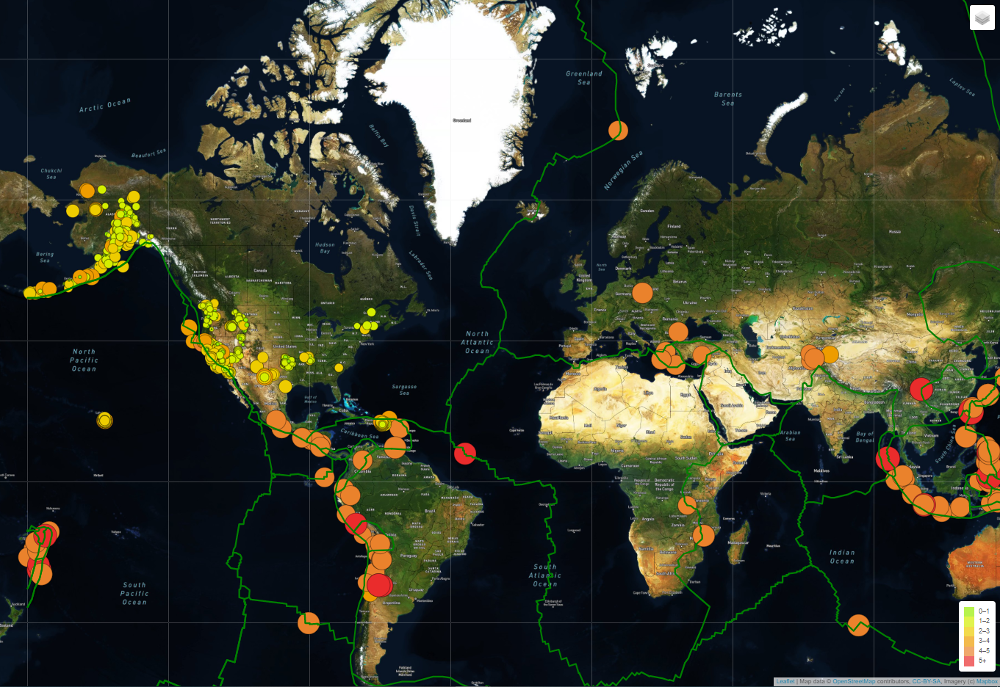

Mapping Earthquakes

This solution displays a world map and overlays the tectonic and earthquake data from the last seven days.   Click here to view the [Maps](https://barharding.github.io/Mapping_Earthquakes//) and select from options in the top right hand corner.  

Options: Dark

Option: Satellite

Option: Streets

